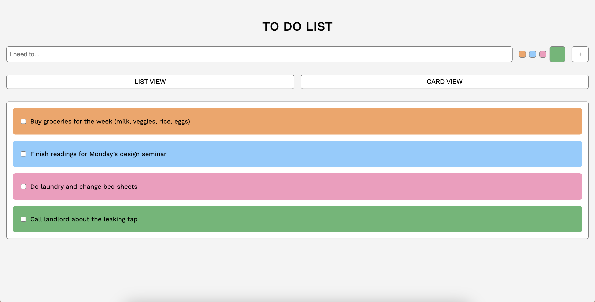
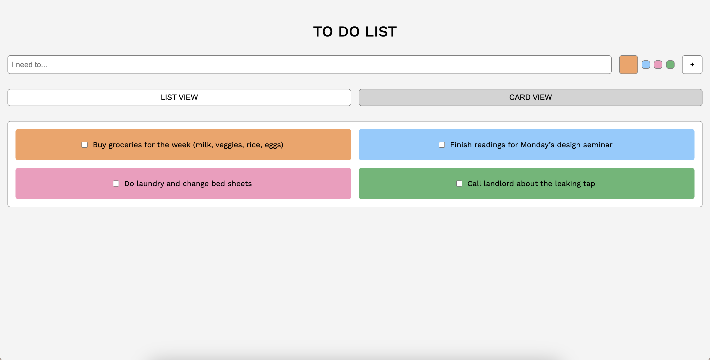

# Project 1 

## Brief

Starting from the concept of a pinboard, implement a web page that:

- Is responsive (properly layout for smartphone, tablet, and desktop)
- Allows the user to add and remove elements
- Allows the user to customise elements (i.e. colours, size)
- Allows the switch between two views (at least) (I have attached an image)

## Project Description

A simple, responsive to-do list web page that lets users add different coloured tasks to a to do list. Users can switch between list and card views, and remove completed items. Tasks persist using localStorage, with intuitive button and keyboard (Enter key) interactions.

## Screenshots

## List of Functions
1. createTaskElement(text, color)
    - Description: Creates a new list element containing a checkbox and a paragraph with the provided text, applies the background colour, and appends it to the to-do list. Adds an event listener to remove the element when its checkbox is clicked and triggers saveTasks() afterward.
    - Arguments: 
        - text (string) — the to-do item content.
        - color (string) — the background colour (HEX or RGB) for the list element.
    - Returns: nothing (undefined)
2. addTask()
    - Description: Reads the current text from the input field. If not empty, it creates a new task using the selected colour by calling createTaskElement(), then clears the input and saves the updated list via saveTasks().
    - Arguments: none
    - Returns: nothing (undefined)
3. saveTasks()
    - Description: Iterates through all list elements in the to-do list, collects their text and background colour and saves this data as a JSON string in localStorage under the key "tasks".
    - Arguments: none
    - Returns: nothing (undefined)
4. loadTasks()
    - Description: Retrieves the "tasks" array from localStorage, parses it from JSON, and recreates each saved task in the interface by calling createTaskElement() for each entry.
    - Arguments: none
    - Returns: nothing (undefined)