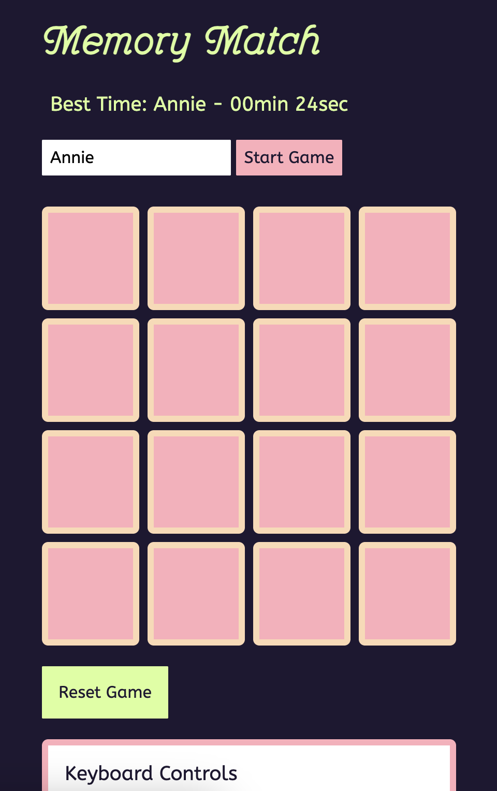
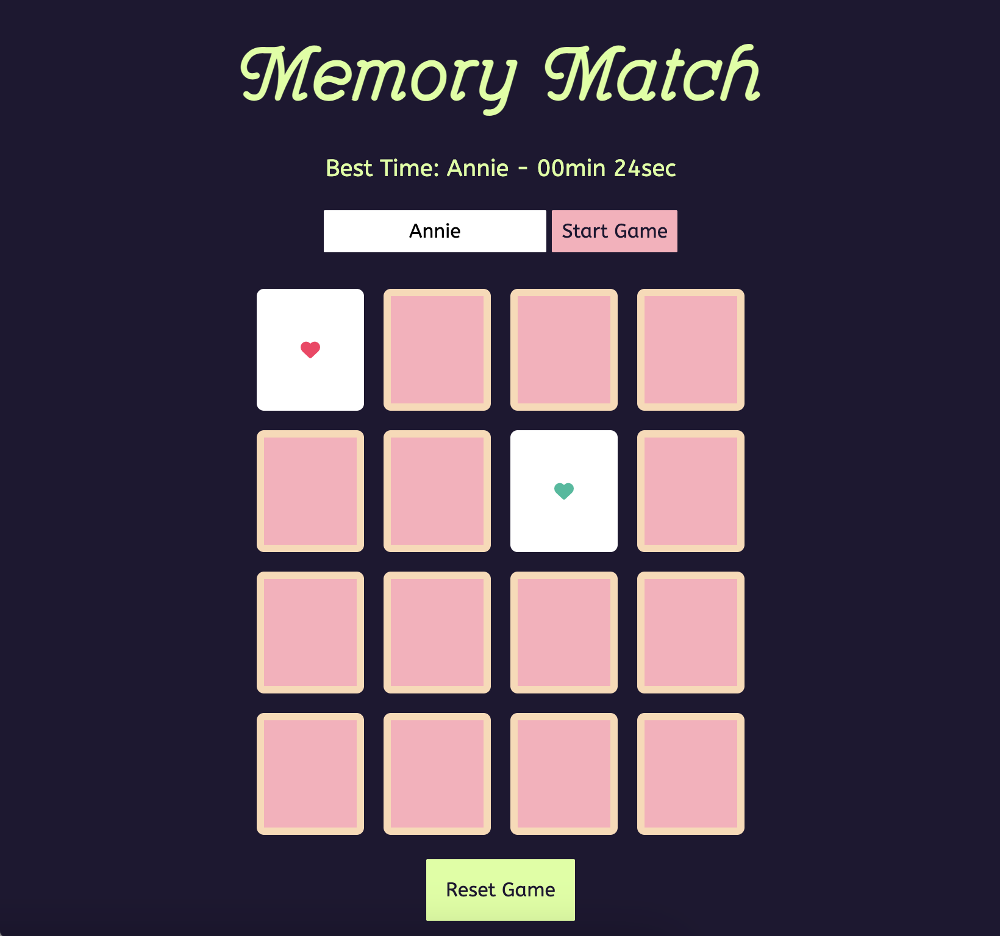
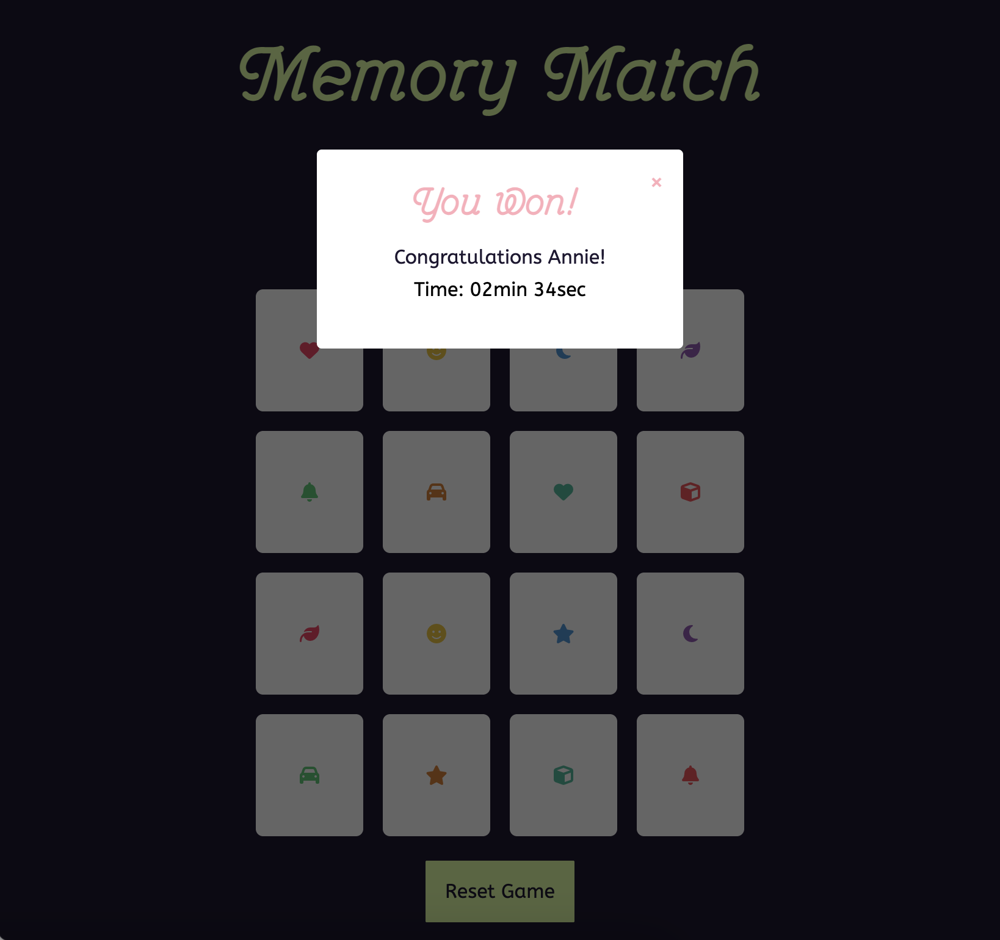

# Assignment 02

## Brief
Choose a “mini-game” to rebuild with HTML, CSS and JavaScript. The requirements are:

- The webpage should be responsive
- Choose an avatar at the beginning of the game
- Keep track of the score of the player
- Use the keyboard to control the game (indicate what are the controls in the page). You can also use buttons (mouse), but also keyboard.
- Use some multimedia files (audio, video, …)
- Implement an “automatic restart” in the game (that is not done via the refresh of the page)

## Screenshots

## Project Description
I built Memory Match as a quick, personal icon-pairing challenge on a 4×4 grid. Sixteen cards hide eight Font Awesome pairs, shuffled each round with Fisher–Yates. Your first flip kicks off the timer; the second decides if it’s a match—pairs stay up, misses flip back after a beat. I track your current flips, matched pairs, and win state; when everything’s solved, the timer stops, a win modal pops, a fanfare plays, and your best time plus name go into localStorage. You can reset anytime to reshuffle and restart. Keyboard play mirrors clicks: arrow keys move a focus highlight and Enter flips, with on-screen reminders. A simple UI keeps status, timer, best-time leaderboard, and start/reset controls front and center for smooth replays.

## Game Flow

## List of the functions
### Setup Data

`icons` Holds 16 Font Awesome icon class names in pairs for matching. 

`iconColors` Supplies a color palette for icons.

`BOARD, STATUS, resetBtn, timerDiv, nameInput, bestTimeDiv, winnerNameDiv, winModal, closeBtn, winSound`
References to DOM elements

`flippedCards, matchedCards` Game state is tracked with flippedCards (current two turned cards) and MatchedCards (all solved cards)

`startTime, endTime` Timer variables. Timer uses startTime, time stamp on first flip, and endTime, time stamp when game ends. 

`BOARD_COLUMNS` Defines grid width for keyboard navigation

`selectedCardIndex, hasKeyboardSelection` Tracks keyboard focus.

### Event wiring

`resetGame()` Clicking the reset button calls resetGame which clears timer state, hides modal and reinitialises the game via initGame.

`handleKeyNavigation`
Document listens for key presses ((KeyboardEvent)) via handleKeyNavigation. The function navigates card grid with arrow keys, tracks selection, highlights, and flips selected card on Enter. Also, skips when typing in inputs.

`closeBtn, window.onclick`
Modal close is set on the “X” (closeBtn) and background click (window.onclick).

### Utilities

`shuffle(array)` [Fisher–Yates](https://medium.com/@omar.rashid2/fisher-yates-shuffle-a2aa15578d2f) shuffle is an algorithm for shuffling a finite sequence, in my case, an array. Shuffle runs Fisher–Yates in place. getCardElements returns all current .card nodes.

`formatGameTime(Number, milliseconds)` Formats the time string, it converts milliseconds to mm min ss sec. 

`getStoredBestTime()` Reads bestTimeMs from localStorage and parses to integer. This function returns the best time in ms as Number, or null if not stored.

`updateBestTimeDisplay()` Reads stored best time and player name, updates best-time UI text accordingly.

`saveBestTimeIfFaster(durationMs, playerName)` Compares duration to stored best; if faster or none exists, saves new best time/name to localStorage and updates display (#best-time).

### Card creation

`createCard(icon, color)`
Ignores if two cards are already up or card is already flipped/matched. On the first meaningful flip starts timer; flips the card, tracks it, and when two are flipped calls checkForMatch.

### Game lifecycle

`initGame` This function clears board/status/state, shuffles a copy of icons, generates coloured cards and appends them. It also resets keyboard selection flags. 

`resetGame`
Clears timer state/UI, hides the modal, and reinitialises the board via initGame..

### Timer

`startGameTimer()` Stores the timestamp value for startTime on the first meaningful flip. 

`endGameTimer()` Stores the timestamp value of the endTime, computes duration, updates the on-page timer, and delegates to saveBestTimeIfFaster with the trimmed name input.

### Card interactions

`flipCard(card)` Ignores if two cards are already up or card is already flipped/matched; on first meaningful flip starts timer; flips the card, tracks it, and when two are flipped calls checkForMatch.

`checkForMatch()` Compares the two flipped cards’ data-icon; on match marks them matched and stores; on mismatch flips them back after 1s; clears flippedCards and calls checkGameOver.

### Win handling

`checkGameOver`
This function is called when all cards are matched. It ends the timer, sets status to “You Won!”, optionally shows “Congratulations <name>!”, reuses the timer display, plays the win sound and shows the modal.

### Keyboard support

`handleKeyNavigation`
This function ignores keys while typing in inputs/text area. Otherwise it navigates the 4-column grid with arrow keys: updates selectedCardIndex if moves are in-bounds, toggles highlighting via highlightSelectedCard, and on Enter flips the selected card (the function is only called after at least one arrow was used, tracked by hasKeyboardSelection). 

`highlightSelectedCard`
Removes prior highlights, clamps the index if needed, and adds .selected to the current card for visual focus.

### Startup
At file bottom, updateBestTimeDisplay() loads any stored best score, then initGame() builds the initial shuffled board.