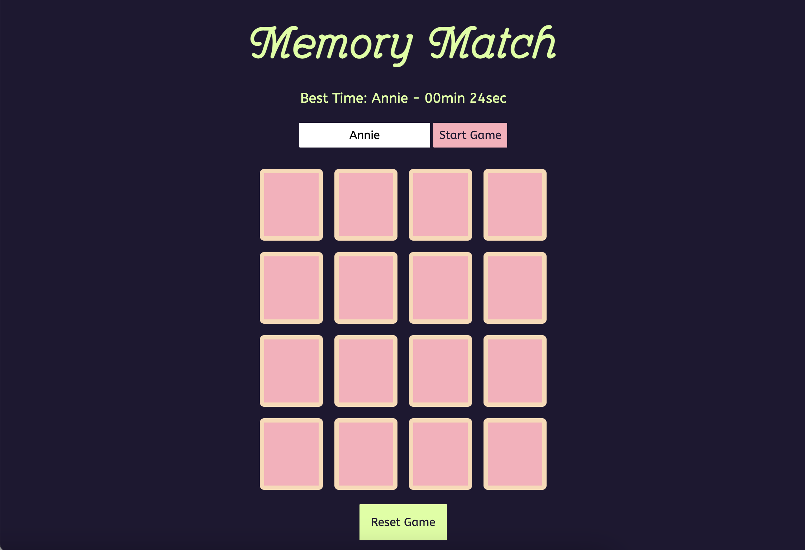
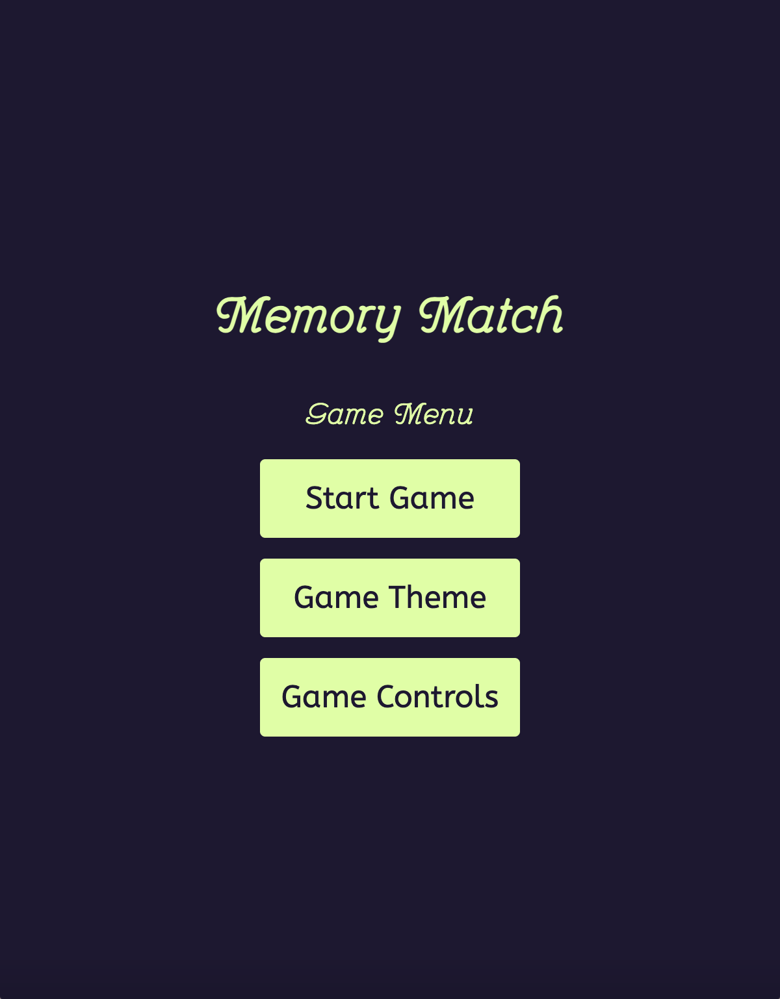
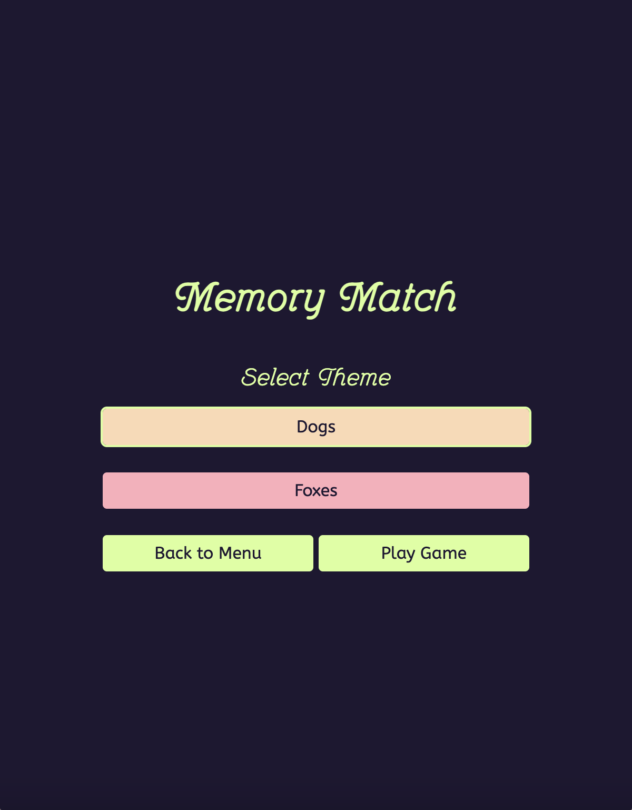
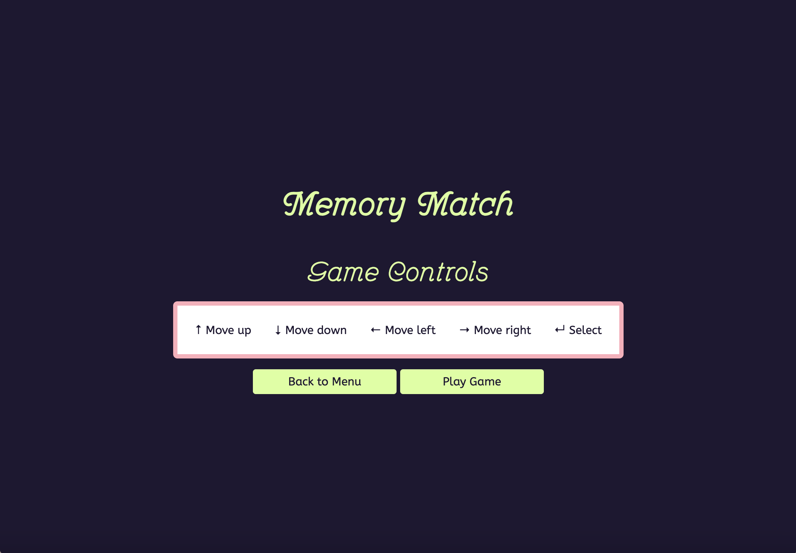

# Assignment 3

## Brief
Choose a “mini-game” to rebuild with HTML, CSS and JavaScript. The requirements are:

- The webpage should be responsive
- Choose an avatar at the beginning of the game
- Keep track of the score of the player
- Use the keyboard to control the game (indicate what are the controls in the page). You can also use buttons (mouse), but also keyboard.
- Use some multimedia files (audio, video, …)
- Implement an “automatic restart” in the game (that is not done via the refresh of the page)

## Screenshots

## Project Description
A browser-based memory game that dynamically builds its card deck using live animal-image APIs. The game implements asynchronous data loading, state-driven matching logic, and both mouse and keyboard navigation. Players receive timing feedback, theme-specific audio, and persistent best-time storage.

## Game Flow

## Function List
`initGame()`
- Arguments: none
- Description: Resets global state, sets the game to loading, fetches and builds the deck for the current theme, preloads images, renders the board, and prepares the interface.
- Returns: Promise<void>

`buildDeckForTheme(theme, pairCount)`
- Arguments: theme:string, pairCount:number
- Description: Looks up the correct deck-builder for the active theme and returns a fully constructed, shuffled deck of card objects.
- Returns: Promise<Array<CardObject>>

`buildDogDeck(pairCount)`
- Arguments: pairCount:number
- Description: Fetches multiple dog images from Dog CEO API, preloads them, constructs card pairs, applies colours, and shuffles the deck.
- Returns: Promise<Array<CardObject>>

`buildFoxDeck(pairCount)`
- Arguments: pairCount:number
- Description: Fetches fox images individually in parallel, extracts URLs, preloads them, constructs card pairs, and shuffles the deck.
- Returns: Promise<Array<CardObject>>

`fetchImages(count, fetcher)`
- Arguments: count:number, fetcher:()`→Promise<string>
- Description: Executes parallel fetch operations to retrieve multiple image URLs.
- Returns: Promise<Array<string>>

`preloadImages(urls)`
- Arguments: urls:Array<string>
- Description: Ensures all images are fully loaded before rendering, preventing flicker or broken cards.
- Returns: Promise<void>

`makeCard(source, pairIndex, variant)`
- Arguments: source:Object, pairIndex:number,- riant:number
- Description: Creates a single card object with identifiers, references to the image source, and metadata for matching.
- Returns: CardObject

`shuffle(array)`
- Arguments: array:Array<any>
- Description: Fisher–Yates shuffle used to randomise card order.
- Returns: array (shuffled)`

`renderBoard(deck)`
- Arguments: deck:Array<CardObject>
- Description: Builds the DOM structure for each card, attaches event listeners, and inserts the final board into the page.
- Returns: void

`flipCard(cardElement)`
- Arguments: cardElement:HTMLElement
- Description: Main interaction handler. Flips cards, manages state, triggers the timer, and calls match evaluation.
- Returns: void

`checkForMatch()`
- Arguments: none
- Description: Compares the two flipped cards using pair identifiers, locks matched pairs, or flips back mismatches.
- Returns: void

`checkGameOver()`
- Arguments: none
- Description: Detects completion, stops timer, plays theme sound, and displays win modal with time and player name.
- Returns: void

`startGameTimer()`
- Arguments: none
- Description: Captures the timestamp of the first flip and starts update intervals for the on-screen timer.
- Returns: void

`endGameTimer()`
- Arguments: none
- Description: Computes duration using timestamp difference, formats time, updates UI, and stores best time.
- Returns: void

`saveBestTimeIfFaster(durationMs, name)`
- Arguments: durationMs:number, name:string
- Description: Compares current run to localStorage and saves if the run is faster.
- Returns: void

`handleKeyNavigation(event)`
- Arguments: event:KeyboardEvent
- Description: Arrow-key grid navigation and Enter-key flip logic. Maintains a selection index and updates highlights.
- Returns: void

`highlightSelectedCard(cards?)`
- Arguments: cards?:Array<HTMLElement>
- Description: Applies/removes focus-highlight class to match the current selection index.
- Returns: void

## Content and Data Sources

### Dog CEO API
- Source of all dog images used in the Dogs theme.
- Endpoint returns random dog images in JSON format.

## RandomFox API
- Source of fox images for the Foxes theme.
- Endpoint returns a single fox image per request (JSON).

## Local assets
- Theme-specific win-sound audio files included in the project.
- All UI, CSS, and interaction logic created manually in the project files (index.html, style.css, script.js).

## LocalStorage
- Stores best time per player name.
- Persists across page refreshes.

## API Documentation

### Dog CEO API

#### Overview
- Base URL: https://dog.ceo/api
- Random images (batched): https://dog.ceo/api/breeds/image/random/{count}
- Method: `GET`
- Response: `{"message": ["url1", "url2", ...], "status": "success"}`

#### Application
- Fetch a batch of {pairCount} images.
- Extract the message array.
- Preload URLs and convert each image into a pair of cards.

### RandomFox API

#### Overview
- Base URL: https://randomfox.ca
- Random images (single): https://randomfox.ca/floof/
- Method: `GET`
- Response: `{"image": "https://randomfox.ca/images/{n}.jpg", "link": "https://..."}`

#### Application
- Called repeatedly to fetch the required number of unique images.
- Image URL extracted from image field.
- Preloaded and turned into card pairs.

### API Handling in the Code

All theme APIs follow the same processing pipeline:
1. Fetch raw data.
2. Validate structure and extract image URLs.
3. Preload all images to avoid rendering delays.
4. Transform URLs into card-source objects.
5. Construct paired card objects using makeCard().
6. Shuffle deck to randomise gameplay.
7. Render into the DOM.

This framework allows adding new themes by defining only:
- A config object,
- A fetcher function,
- A builder function that returns a deck.
